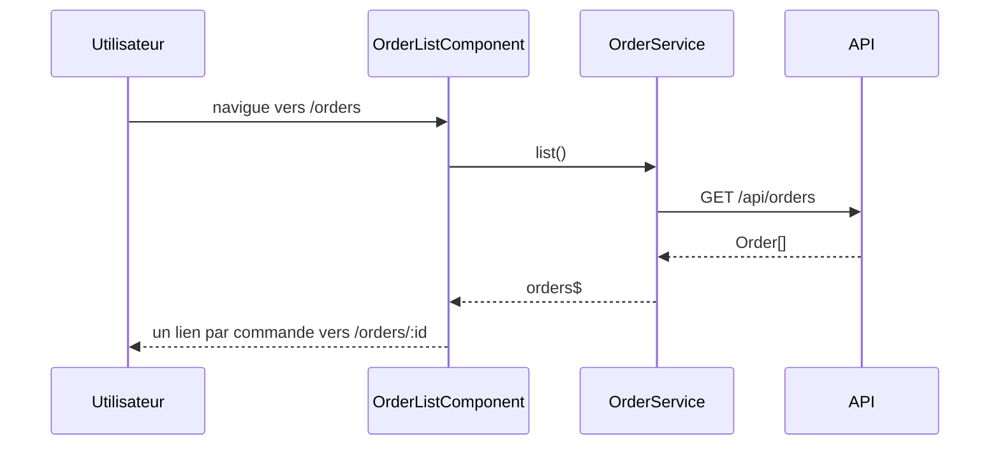
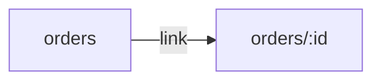

# /orders — liste des commandes
`route.orders` · type: routes · last updated: 2026-09-16 · commit: 973d403

## Summary

Liste les commandes : `OrderListComponent` charge toutes les commandes via `OrderService.list()` et
affiche pour chacune le nom du client, avec un lien vers sa fiche `/orders/:id`.

## Trigger

| Element | Value |
|---|---|
| Entry point | `/orders` (`orders`) |
| Security | — |
| Preconditions | L'API `/api/orders` est joignable depuis le navigateur (même origine ou proxy de développement). |

## Journey

## Navigation / states

## Decisions

—

## Data

Lit des `Order` (`id`, `customer`) depuis l'API HTTP ; aucune écriture.

## Cross-cutting mechanisms

Aucun intercepteur HTTP ni garde de route n'est déclaré dans `src/app`.

## Points of attention

Aucun état de chargement ni de gestion d'erreur : si l'API échoue, la liste reste vide sans message.

## Related workflows

- [`route.orders-id`](orders-id.md) — navigation

## History

| Date | Commit | Change |
|---|---|---|
| 2026-09-16 | 973d403 | rédaction initiale |
