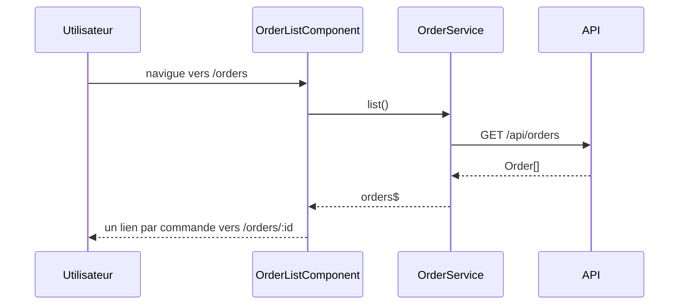
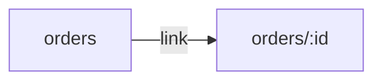

# /orders — liste des commandes
`route.orders` · type : routes · dernière mise à jour : 2026-09-16 · commit : 973d403

## Résumé

Liste les commandes : `OrderListComponent` charge toutes les commandes via `OrderService.list()` et
affiche pour chacune le nom du client, avec un lien vers sa fiche `/orders/:id`.

## Déclencheur

| Élément | Valeur |
|---|---|
| Point d'entrée | `/orders` (`orders`) |
| Sécurité | — |
| Préconditions | L'API `/api/orders` est joignable depuis le navigateur (même origine ou proxy de développement). |

## Parcours

## Navigation / états

## Décisions

—

## Données

Lit des `Order` (`id`, `customer`) depuis l'API HTTP ; aucune écriture.

## Mécanismes transverses

Aucun intercepteur HTTP ni garde de route n'est déclaré dans `src/app`.

## Points d'attention

Aucun état de chargement ni de gestion d'erreur : si l'API échoue, la liste reste vide sans message.

## Workflows liés

- [`route.orders-id`](orders-id.md) — navigation

## Historique

| Date | Commit | Changement |
|---|---|---|
| 2026-09-16 | 973d403 | rédaction initiale |
