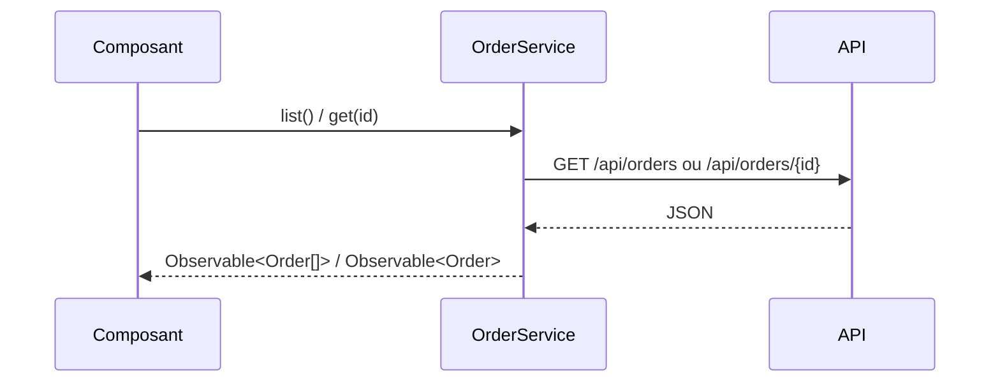

# OrderService → /api/orders
`integration.orderservice` · type : integrations · dernière mise à jour : 2026-09-16 · commit : 237c2d7

## Résumé

`OrderService` est le seul point d'accès aux commandes : un service Angular fourni à la racine qui
appelle l'API REST des commandes avec `HttpClient`.

## Déclencheur

| Élément | Valeur |
|---|---|
| Point d'entrée | `OrderService` (integration) |
| Calls | `GET /api/orders, GET /api/orders/{id}` |
| Sécurité | — |
| Préconditions | `HttpClient` est fourni à l'application (`provideHttpClient`). |

## Parcours

## Navigation / états

—

## Composants impliqués

| Rôle | Fichier | Notes |
|---|---|---|
| Service | `src/app/orders/order.service.ts` | point d'entrée |

## Données

Lit `Order` (`id: number`, `customer: string`) ; l'interface est déclarée dans le service.

## Mécanismes transverses

Aucun : ni intercepteur, ni cache, ni reprise sur erreur.

## Points d'attention

Les réponses ne sont pas validées : le typage `Order` est une promesse, pas un contrôle.

## Tests existants

—

## Workflows liés

—

## Historique

| Date | Commit | Changement |
|---|---|---|
| 2026-09-16 | 237c2d7 | rédaction initiale |
