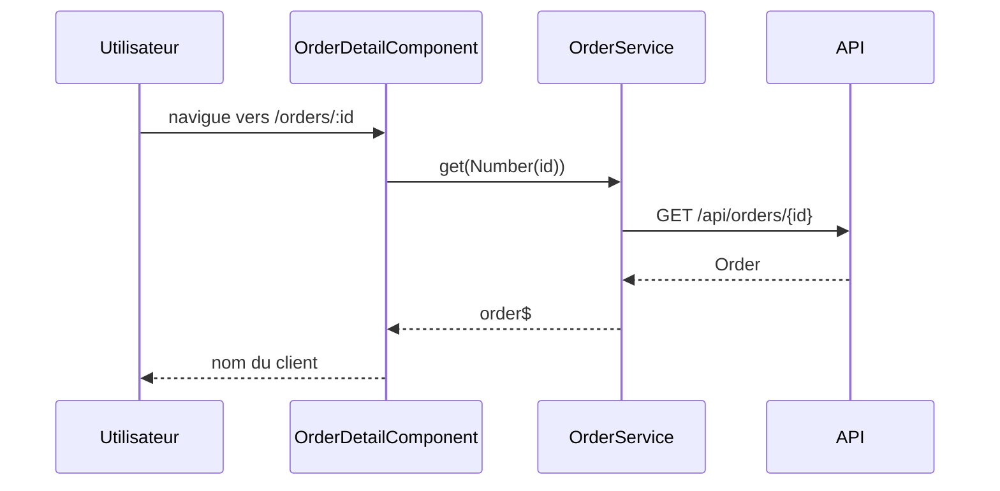

# /orders/:id — fiche d'une commande
`route.orders-id` · type : routes · dernière mise à jour : 2026-09-16 · commit : 237c2d7

## Résumé

Affiche une commande : `OrderDetailComponent` lit l'identifiant dans l'URL et charge la commande via
`OrderService.get(id)`, puis affiche le nom du client.

## Déclencheur

| Élément | Valeur |
|---|---|
| Point d'entrée | `/orders/:id` (`orders/:id`) |
| Sécurité | — |
| Préconditions | La commande existe côté API ; on arrive en général depuis la liste `/orders`. |

## Parcours

## Navigation / états

—

## Composants impliqués

| Rôle | Fichier | Notes |
|---|---|---|
| Configuration | `src/app/app.routes.ts` | point d'entrée |
| Composant | `src/app/orders/order-detail.component.ts` |  |
| Service | `src/app/orders/order.service.ts` |  |

## Données

Lit une `Order` (`id`, `customer`) depuis l'API HTTP ; aucune écriture.

## Mécanismes transverses

Aucun intercepteur HTTP ni garde de route n'est déclaré dans `src/app`.

## Points d'attention

L'identifiant est lu dans le snapshot de la route : naviguer d'une fiche à une autre sans recréer le
composant n'actualise pas la commande. Un identifiant non numérique donne `NaN` et appelle `/api/orders/NaN`.

## Tests existants

—

## Workflows liés

—

## Historique

| Date | Commit | Changement |
|---|---|---|
| 2026-09-16 | 237c2d7 | rédaction initiale |
