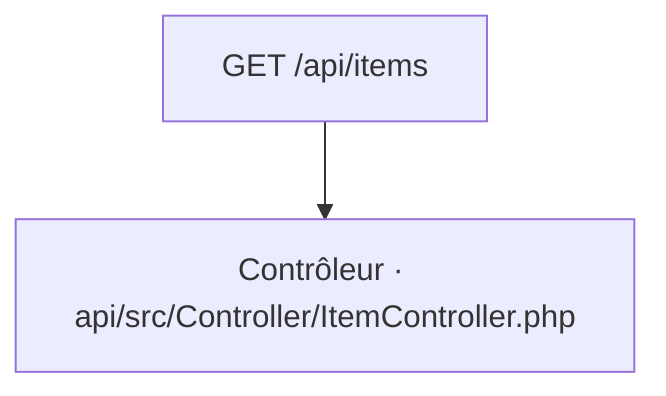

# GET /api/items
`route.api.item.list` · type : routes · dernière mise à jour : 2026-09-16 · commit : a8278df

## Résumé

—

## Déclencheur

| Élément | Valeur |
|---|---|
| Point d'entrée | `GET /api/items` (`api_item_list`) |
| Sécurité | — |
| Préconditions | — |

## Parcours

## Navigation / états

—

## Composants impliqués

| Rôle | Fichier | Notes |
|---|---|---|
| Contrôleur | `api/src/Controller/ItemController.php` | point d'entrée |

## Données

—

## Mécanismes transverses

—

## Points d'attention

—

## Tests existants

—

## Workflows liés

—

## Historique

| Date | Commit | Changement |
|---|---|---|
| 2026-09-16 | a8278df | initial |
