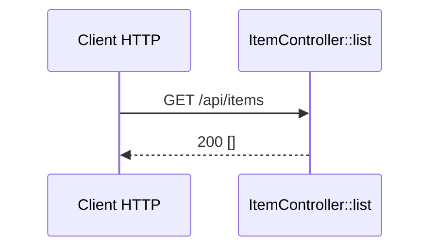

# GET /api/items
`route.api.item.list` · type : routes · dernière mise à jour : 2026-09-16 · commit : 6ecdbd0

## Résumé

Point d'API `GET /api/items` de l'application `api` : `ItemController::list()` répond une liste JSON,
aujourd'hui toujours vide.

## Déclencheur

| Élément | Valeur |
|---|---|
| Point d'entrée | `GET /api/items` (`api_item_list`) |
| Sécurité | — |
| Préconditions | — |

## Parcours

## Navigation / états

—

## Décisions

—

## Données

Aucune : la réponse est un tableau vide construit en dur.

## Mécanismes transverses

Aucun listener ni règle de sécurité n'est déclaré dans `api/`.

## Points d'attention

Le front `/items` n'appelle pas encore ce point d'API : les deux côtés du monorepo ne sont pas reliés.

## Workflows liés

—

## Historique

| Date | Commit | Changement |
|---|---|---|
| 2026-09-16 | 6ecdbd0 | rédaction initiale |
