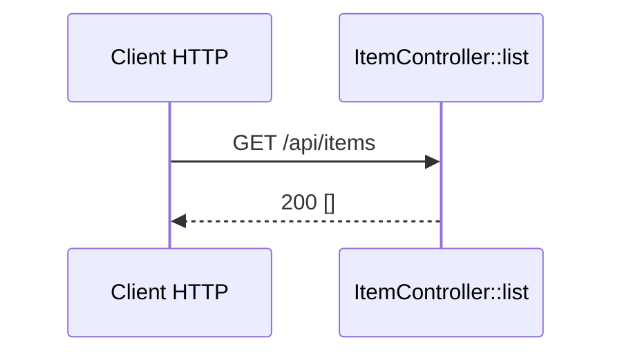

# GET /api/items
`route.api.item.list` · type: routes · last updated: 2026-09-16 · commit: 6ecdbd0

## Summary

Point d'API `GET /api/items` de l'application `api` : `ItemController::list()` répond une liste JSON,
aujourd'hui toujours vide.

## Trigger

| Element | Value |
|---|---|
| Entry point | `GET /api/items` (`api_item_list`) |
| Security | — |
| Preconditions | — |

## Journey

## Navigation / states

—

## Decisions

—

## Data

Aucune : la réponse est un tableau vide construit en dur.

## Cross-cutting mechanisms

Aucun listener ni règle de sécurité n'est déclaré dans `api/`.

## Points of attention

Le front `/items` n'appelle pas encore ce point d'API : les deux côtés du monorepo ne sont pas reliés.

## Related workflows

—

## History

| Date | Commit | Change |
|---|---|---|
| 2026-09-16 | 6ecdbd0 | rédaction initiale |
