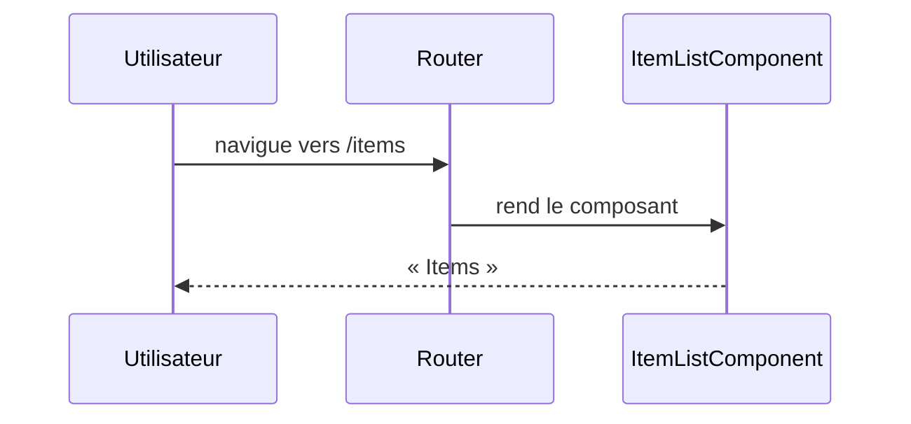

# /items
`route.items` · type : routes · dernière mise à jour : 2026-09-16 · commit : 6ecdbd0

## Résumé

Page `/items` du front Angular : la route rend `ItemListComponent`, qui n'affiche pour l'instant qu'un titre.

## Déclencheur

| Élément | Valeur |
|---|---|
| Point d'entrée | `/items` (`items`) |
| Sécurité | — |
| Préconditions | — |

## Parcours

## Navigation / états

—

## Décisions

—

## Données

Aucune : le composant ne charge rien.

## Mécanismes transverses

Aucun garde ni intercepteur n'est déclaré dans `front/src/app`.

## Points d'attention

Le composant n'utilise pas `GET /api/items` de l'application `api` : la page est un squelette.

## Workflows liés

—

## Historique

| Date | Commit | Changement |
|---|---|---|
| 2026-09-16 | 6ecdbd0 | rédaction initiale |
