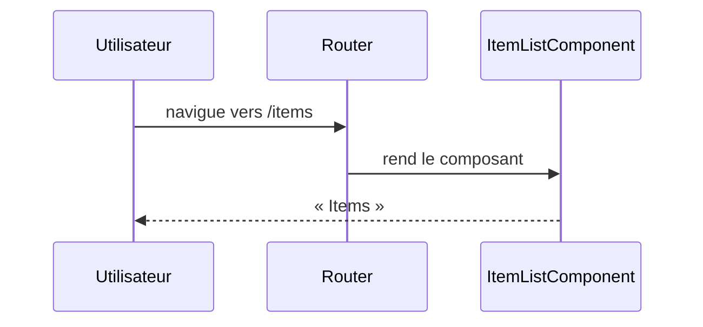

# /items
`route.items` · type: routes · last updated: 2026-09-16 · commit: 6ecdbd0

## Summary

Page `/items` du front Angular : la route rend `ItemListComponent`, qui n'affiche pour l'instant qu'un titre.

## Trigger

| Element | Value |
|---|---|
| Entry point | `/items` (`items`) |
| Security | — |
| Preconditions | — |

## Journey

## Navigation / states

—

## Decisions

—

## Data

Aucune : le composant ne charge rien.

## Cross-cutting mechanisms

Aucun garde ni intercepteur n'est déclaré dans `front/src/app`.

## Points of attention

Le composant n'utilise pas `GET /api/items` de l'application `api` : la page est un squelette.

## Related workflows

—

## History

| Date | Commit | Change |
|---|---|---|
| 2026-09-16 | 6ecdbd0 | rédaction initiale |
