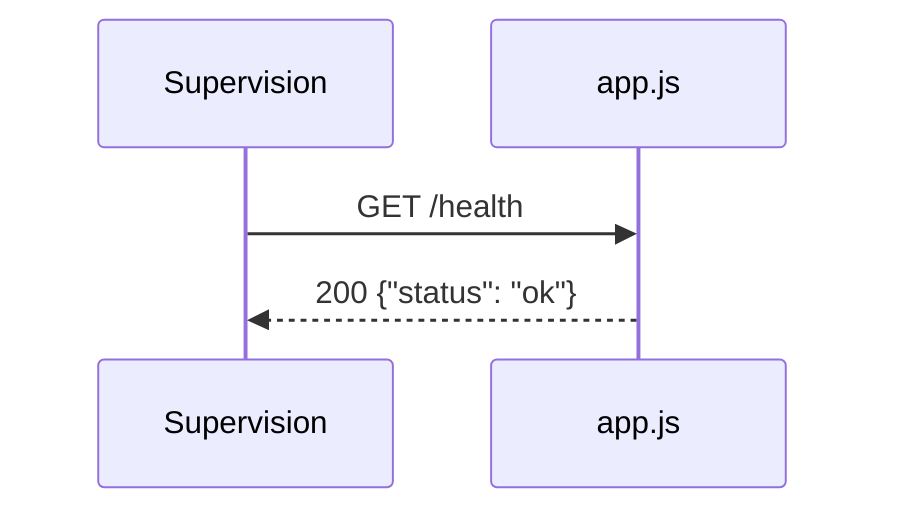

# GET /health
`route.get-health` · type : routes · dernière mise à jour : 2026-09-16 · commit : f2bd976

## Résumé

`GET /health` répond `{"status": "ok"}` pour signaler que le processus tourne.

## Déclencheur

| Élément | Valeur |
|---|---|
| Point d'entrée | `GET /health` (`GET /health`) |
| Sécurité | — |
| Préconditions | — |

## Parcours

## Navigation / états

—

## Décisions

—

## Données

Aucune.

## Mécanismes transverses

Déclarée directement sur `app`, hors de tout routeur.

## Points d'attention

La réponse ne vérifie aucune dépendance : elle reste « ok » même si le service de commandes est cassé.

## Workflows liés

—

## Historique

| Date | Commit | Changement |
|---|---|---|
| 2026-09-16 | f2bd976 | rédaction initiale |
