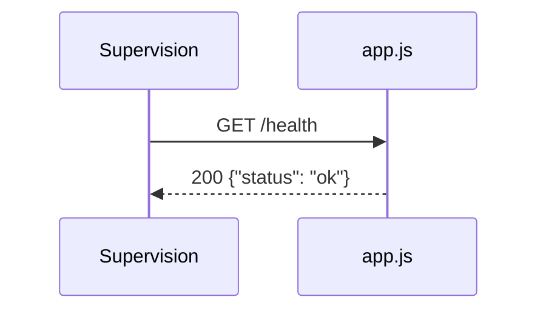

# GET /health
`route.get-health` · type: routes · last updated: 2026-09-16 · commit: f2bd976

## Summary

`GET /health` répond `{"status": "ok"}` pour signaler que le processus tourne.

## Trigger

| Element | Value |
|---|---|
| Entry point | `GET /health` (`GET /health`) |
| Security | — |
| Preconditions | — |

## Journey

## Navigation / states

—

## Decisions

—

## Data

Aucune.

## Cross-cutting mechanisms

Déclarée directement sur `app`, hors de tout routeur.

## Points of attention

La réponse ne vérifie aucune dépendance : elle reste « ok » même si le service de commandes est cassé.

## Related workflows

—

## History

| Date | Commit | Changement |
|---|---|---|
| 2026-09-16 | f2bd976 | rédaction initiale |
