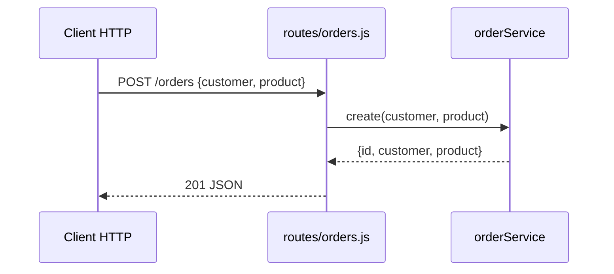

# POST /orders
`route.post-orders` · type: routes · last updated: 2026-09-16 · commit: f2bd976

## Summary

`POST /orders` crée une commande à partir de `customer` et `product` du corps JSON et la renvoie avec le
statut 201.

## Trigger

| Element | Value |
|---|---|
| Entry point | `POST /orders` (`POST /orders`) |
| Security | — |
| Preconditions | Corps de requête en JSON (`Content-Type: application/json`). |

## Journey

## Navigation / states

—

## Decisions

—

## Data

Ajoute une commande au tableau en mémoire ; l'identifiant vaut la taille du tableau plus un.

## Cross-cutting mechanisms

`express.json()` analyse le corps avant le routeur.

## Points of attention

Aucune validation : un corps sans `customer` crée une commande incomplète, et un corps absent lève une
erreur sur `req.body.customer`. Aucun test ne couvre la création.

## Related workflows

—

## History

| Date | Commit | Changement |
|---|---|---|
| 2026-09-16 | f2bd976 | rédaction initiale |
