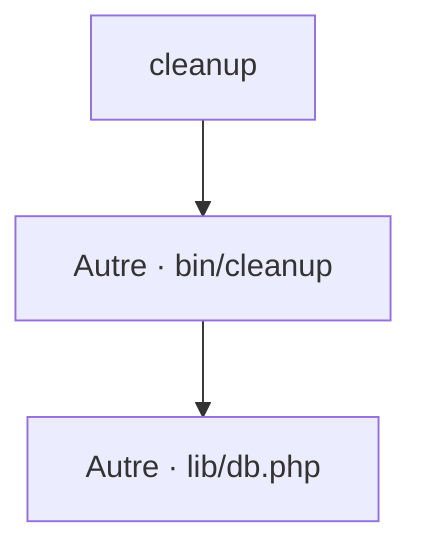

# cleanup
`command.cleanup` · type : commands · dernière mise à jour : 2026-09-16 · commit : 2620449

## Résumé

—

## Déclencheur

| Élément | Valeur |
|---|---|
| Point d'entrée | `cleanup` (command) |
| Sécurité | — |
| Préconditions | — |

## Parcours

## Navigation / états

—

## Composants impliqués

| Rôle | Fichier | Notes |
|---|---|---|
| Autre | `bin/cleanup` | point d'entrée |
| Configuration | `composer.json` |  |
| Autre | `lib/db.php` |  |

## Données

—

## Mécanismes transverses

—

## Points d'attention

—

## Tests existants

—

## Workflows liés

—

## Historique

| Date | Commit | Changement |
|---|---|---|
| 2026-09-16 | 2620449 | initial |
