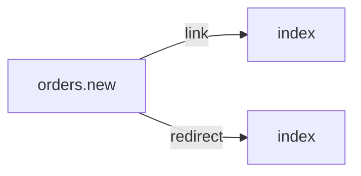

# /orders/new.php
`route.orders.new` · type: routes · last updated: 2026-09-16 · commit: 2620449

## Summary

—

## Trigger

| Element | Value |
|---|---|
| Entry point | `/orders/new.php` (`orders.new`) |
| Security | — |
| Preconditions | — |

## Journey

—

## Navigation / states

## Decisions

—

## Data

—

## Cross-cutting mechanisms

—

## Points of attention

—

## Related workflows

- [`route.index`](index.md) — navigation

## History

| Date | Commit | Changement |
|---|---|---|
| 2026-09-16 | 2620449 | initial |
