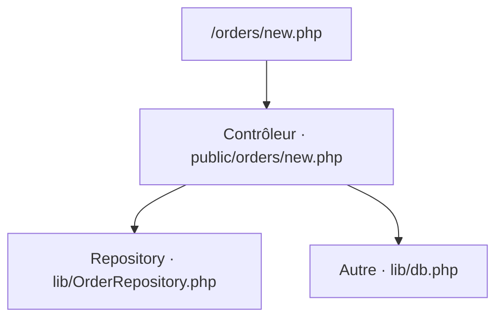
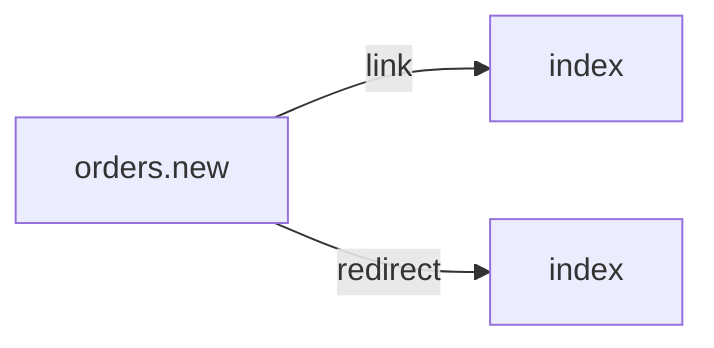

# /orders/new.php
`route.orders.new` · type : routes · dernière mise à jour : 2026-09-16 · commit : 2620449

## Résumé

—

## Déclencheur

| Élément | Valeur |
|---|---|
| Point d'entrée | `/orders/new.php` (`orders.new`) |
| Sécurité | — |
| Préconditions | — |

## Parcours

## Navigation / états

## Composants impliqués

| Rôle | Fichier | Notes |
|---|---|---|
| Repository | `lib/OrderRepository.php` |  |
| Autre | `lib/db.php` |  |
| Contrôleur | `public/orders/new.php` | point d'entrée |

## Données

—

## Mécanismes transverses

—

## Points d'attention

—

## Tests existants

| Test | Fichier | Couvre |
|---|---|---|
| OrderRepositoryTest | `tests/OrderRepositoryTest.php` | — |

## Workflows liés

- [`route.index`](index.md) — navigation

## Historique

| Date | Commit | Changement |
|---|---|---|
| 2026-09-16 | 2620449 | initial |
