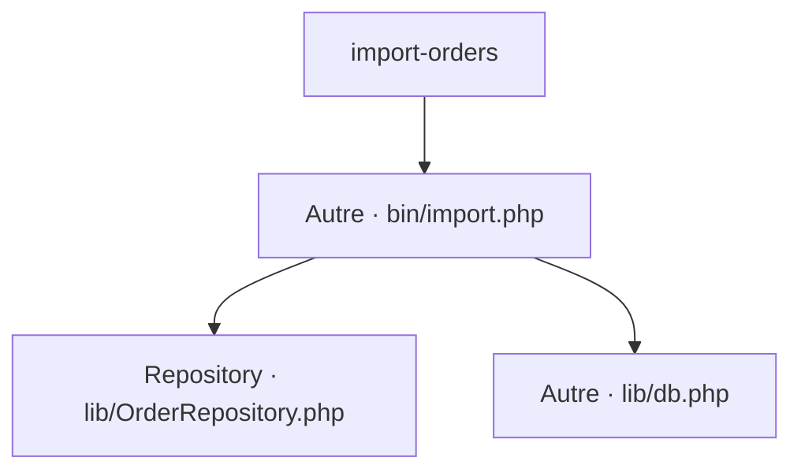

# import-orders
`command.import-orders` · type : commands · dernière mise à jour : 2026-09-16 · commit : 84499fa

## Résumé

—

## Déclencheur

| Élément | Valeur |
|---|---|
| Point d'entrée | `import-orders` (command) |
| Sécurité | — |
| Préconditions | — |

## Parcours

## Navigation / états

—

## Composants impliqués

| Rôle | Fichier | Notes |
|---|---|---|
| Autre | `bin/import.php` | point d'entrée |
| Configuration | `composer.json` |  |
| Repository | `lib/OrderRepository.php` |  |
| Autre | `lib/db.php` |  |

## Données

—

## Mécanismes transverses

—

## Points d'attention

—

## Tests existants

| Test | Fichier | Couvre |
|---|---|---|
| OrderRepositoryTest | `tests/OrderRepositoryTest.php` | — |

## Workflows liés

—

## Historique

| Date | Commit | Changement |
|---|---|---|
| 2026-09-16 | 84499fa | initial |
