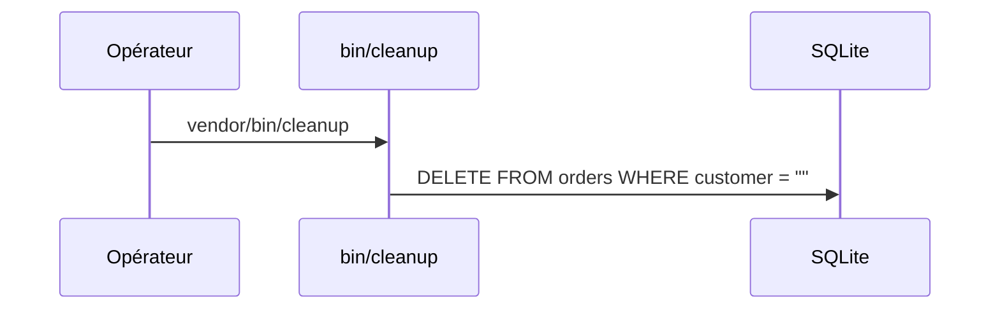

# cleanup
`command.cleanup` · type : commands · dernière mise à jour : 2026-09-16 · commit : 2620449

## Résumé

`bin/cleanup`, déclaré dans `bin` de `composer.json`, supprime les commandes dont le client est vide.

## Déclencheur

| Élément | Valeur |
|---|---|
| Point d'entrée | `cleanup` (command) |
| Sécurité | — |
| Préconditions | La table `orders` existe. |

## Parcours

## Navigation / états

—

## Décisions

—

## Données

Supprime des lignes de `orders`.

## Mécanismes transverses

`lib/db.php` fournit la connexion PDO.

## Points d'attention

La condition `customer = ""` utilise des guillemets doubles : SQLite les accepte comme chaîne par
tolérance, d'autres bases y verraient un nom de colonne. Rien n'est affiché ni journalisé.

## Workflows liés

—

## Historique

| Date | Commit | Changement |
|---|---|---|
| 2026-09-16 | 2620449 | rédaction initiale |
