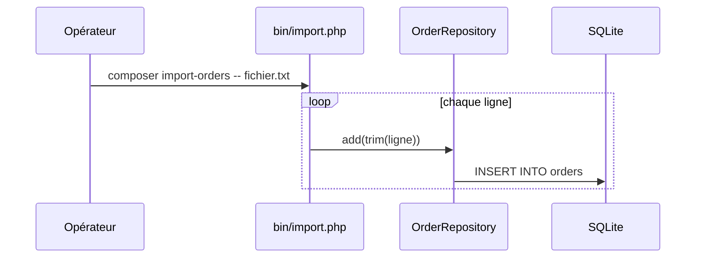

# import-orders
`command.import-orders` · type: commands · last updated: 2026-09-16 · commit: 2620449

## Summary

`composer import-orders` importe des commandes depuis un fichier texte, un client par ligne, ou depuis
l'entrée standard : chaque ligne devient une commande via `OrderRepository::add()`.

## Trigger

| Element | Value |
|---|---|
| Entry point | `import-orders` (command) |
| Security | — |
| Preconditions | La table `orders` existe ; le fichier passé en argument est lisible. |

## Journey

## Navigation / states

—

## Decisions

—

## Data

Écrit une ligne dans `orders` par ligne lue.

## Cross-cutting mechanisms

`lib/db.php` fournit la connexion PDO.

## Points of attention

Pas de transaction : une erreur au milieu du fichier laisse un import partiel. Les lignes vides deviennent
des commandes sans client.

## Related workflows

—

## History

| Date | Commit | Change |
|---|---|---|
| 2026-09-16 | 2620449 | rédaction initiale |
