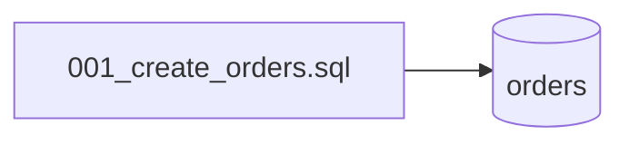

# Migrations
`data.migrations` · type: data · last updated: 2026-09-16 · commit: 2620449

## Summary

Schéma de la base : une seule migration SQL crée la table `orders` (`id`, `customer`).

## Trigger

| Element | Value |
|---|---|
| Entry point | `migrations` (migration) |
| Security | — |
| Preconditions | — |

## Journey

## Navigation / states

—

## Decisions

—

## Data

Table `orders` : `id INTEGER PRIMARY KEY`, `customer TEXT NOT NULL`.

## Cross-cutting mechanisms

Aucun outil de migration : le fichier est exécuté à la main, et par `OrderRepositoryTest` sur une base en
mémoire.

## Points of attention

Rien n'indique quelles migrations ont été jouées sur une base existante.

## Related workflows

—

## History

| Date | Commit | Changement |
|---|---|---|
| 2026-09-16 | 2620449 | rédaction initiale |
