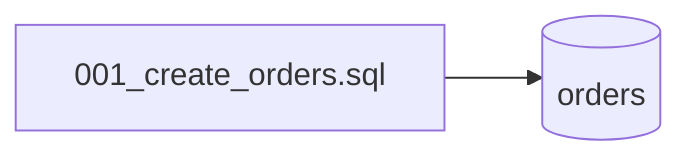

# Migrations
`data.migrations` · type : data · dernière mise à jour : 2026-09-16 · commit : 2620449

## Résumé

Schéma de la base : une seule migration SQL crée la table `orders` (`id`, `customer`).

## Déclencheur

| Élément | Valeur |
|---|---|
| Point d'entrée | `migrations` (migration) |
| Sécurité | — |
| Préconditions | — |

## Parcours

## Navigation / états

—

## Décisions

—

## Données

Table `orders` : `id INTEGER PRIMARY KEY`, `customer TEXT NOT NULL`.

## Mécanismes transverses

Aucun outil de migration : le fichier est exécuté à la main, et par `OrderRepositoryTest` sur une base en
mémoire.

## Points d'attention

Rien n'indique quelles migrations ont été jouées sur une base existante.

## Workflows liés

—

## Historique

| Date | Commit | Changement |
|---|---|---|
| 2026-09-16 | 2620449 | rédaction initiale |
