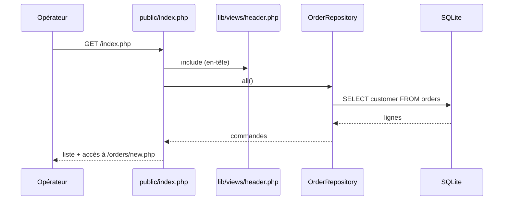
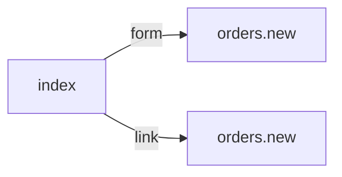

# /index.php
`route.index` · type: routes · last updated: 2026-09-16 · commit: 2620449

## Summary

Page d'accueil du back-office : liste le client de chaque commande, lue par `OrderRepository::all()`, et
propose de créer une commande (bouton de formulaire et lien vers `/orders/new.php`).

## Trigger

| Element | Value |
|---|---|
| Entry point | `/index.php` (`index`) |
| Security | — |
| Preconditions | La base SQLite var/app.sqlite existe et contient la table `orders` (migration `001_create_orders.sql`). |

## Journey

## Navigation / states

## Decisions

—

## Data

Lit la colonne `customer` de la table `orders` ; aucune écriture.

## Cross-cutting mechanisms

`lib/db.php` fournit une connexion PDO unique par requête (variable statique de `db()`).

## Points of attention

La connexion vise var/app.sqlite en dur : aucune configuration par environnement. Aucune pagination ni
tri, et aucune authentification ne protège la page.

## Related workflows

- [`route.orders.new`](orders.new.md) — navigation

## History

| Date | Commit | Changement |
|---|---|---|
| 2026-09-16 | 2620449 | rédaction initiale |
