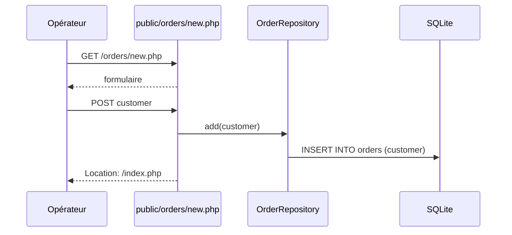
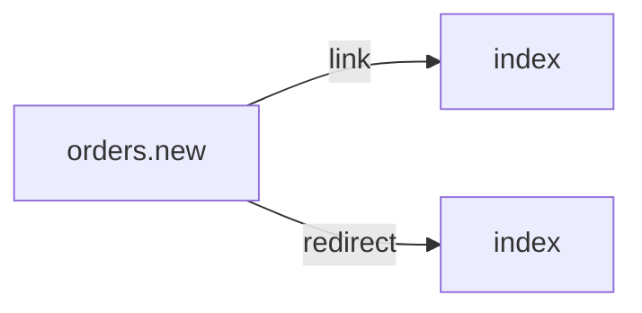

# /orders/new.php
`route.orders.new` · type: routes · last updated: 2026-09-16 · commit: 2620449

## Summary

Crée une commande : en GET, affiche un formulaire avec le nom du client ; en POST, enregistre la commande par
`OrderRepository::add()` puis redirige vers `/index.php`.

## Trigger

| Element | Value |
|---|---|
| Entry point | `/orders/new.php` (`orders.new`) |
| Security | — |
| Preconditions | La table `orders` existe. |

## Journey

## Navigation / states

## Decisions

—

## Data

Écrit une ligne dans `orders` (colonne `customer`), par une requête préparée.

## Cross-cutting mechanisms

`lib/db.php` fournit la connexion PDO.

## Points of attention

Aucune validation : un nom vide est enregistré (c'est ce que `bin/cleanup` supprime ensuite), et aucun
jeton CSRF ne protège le formulaire.

## Related workflows

- [`route.index`](index.md) — navigation

## History

| Date | Commit | Changement |
|---|---|---|
| 2026-09-16 | 2620449 | rédaction initiale |
