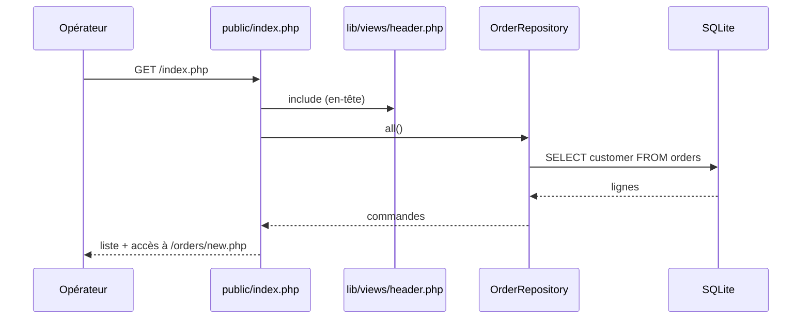
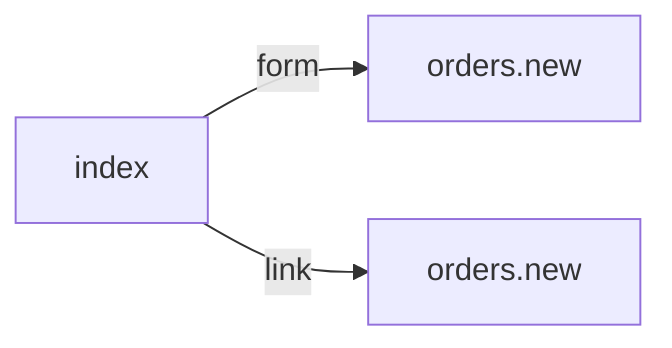

# /index.php
`route.index` · type : routes · dernière mise à jour : 2026-09-16 · commit : 84499fa

## Résumé

Page d'accueil du back-office : liste le client de chaque commande, lue par `OrderRepository::all()`, et
propose de créer une commande (bouton de formulaire et lien vers `/orders/new.php`).

## Déclencheur

| Élément | Valeur |
|---|---|
| Point d'entrée | `/index.php` (`index`) |
| Sécurité | — |
| Préconditions | La base SQLite var/app.sqlite existe et contient la table `orders` (migration `001_create_orders.sql`). |

## Parcours

## Navigation / états

## Composants impliqués

| Rôle | Fichier | Notes |
|---|---|---|
| Repository | `lib/OrderRepository.php` |  |
| Autre | `lib/db.php` |  |
| Autre | `lib/views/header.php` |  |
| Contrôleur | `public/index.php` | point d'entrée |

## Données

Lit la colonne `customer` de la table `orders` ; aucune écriture.

## Mécanismes transverses

`lib/db.php` fournit une connexion PDO unique par requête (variable statique de `db()`).

## Points d'attention

La connexion vise var/app.sqlite en dur : aucune configuration par environnement. Aucune pagination ni
tri, et aucune authentification ne protège la page.

## Tests existants

| Test | Fichier | Couvre |
|---|---|---|
| OrderRepositoryTest | `tests/OrderRepositoryTest.php` | — |

## Workflows liés

- [`route.orders.new`](orders.new.md) — navigation

## Historique

| Date | Commit | Changement |
|---|---|---|
| 2026-09-16 | 84499fa | rédaction initiale |
