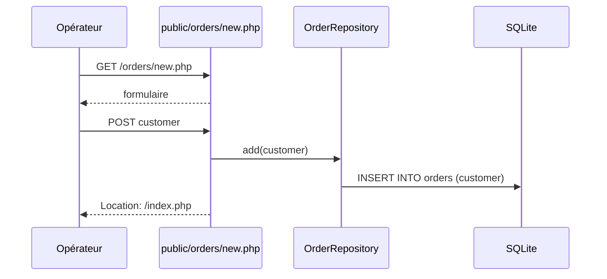
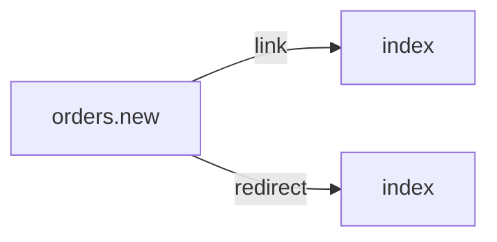

# /orders/new.php
`route.orders.new` · type : routes · dernière mise à jour : 2026-09-16 · commit : 84499fa

## Résumé

Crée une commande : en GET, affiche un formulaire avec le nom du client ; en POST, enregistre la commande par
`OrderRepository::add()` puis redirige vers `/index.php`.

## Déclencheur

| Élément | Valeur |
|---|---|
| Point d'entrée | `/orders/new.php` (`orders.new`) |
| Sécurité | — |
| Préconditions | La table `orders` existe. |

## Parcours

## Navigation / états

## Composants impliqués

| Rôle | Fichier | Notes |
|---|---|---|
| Repository | `lib/OrderRepository.php` |  |
| Autre | `lib/db.php` |  |
| Contrôleur | `public/orders/new.php` | point d'entrée |

## Données

Écrit une ligne dans `orders` (colonne `customer`), par une requête préparée.

## Mécanismes transverses

`lib/db.php` fournit la connexion PDO.

## Points d'attention

Aucune validation : un nom vide est enregistré (c'est ce que `bin/cleanup` supprime ensuite), et aucun
jeton CSRF ne protège le formulaire.

## Tests existants

| Test | Fichier | Couvre |
|---|---|---|
| OrderRepositoryTest | `tests/OrderRepositoryTest.php` | — |

## Workflows liés

- [`route.index`](index.md) — navigation

## Historique

| Date | Commit | Changement |
|---|---|---|
| 2026-09-16 | 84499fa | rédaction initiale |
