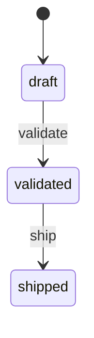

# /orders
`order` · type : routes · 4 routes · `src/Controller/OrderController.php`

## Résumé

—

## Routes

| Route | Chemin | Méthodes | Sécurité |
|---|---|---|---|
| [`app_order_index`](index.md) | `/orders` | `GET` | `ROLE_USER` |
| [`app_order_new`](new.md) | `/orders/new` | `GET\|POST` | `ROLE_USER`, `ROLE_OPERATOR` |
| [`app_order_show`](show.md) | `/orders/{id}` | `GET` | `ROLE_USER` |
| [`app_order_validate`](validate.md) | `/orders/{id}/validate` | `POST` | `ROLE_USER`, `ROLE_MANAGER` |

## États

