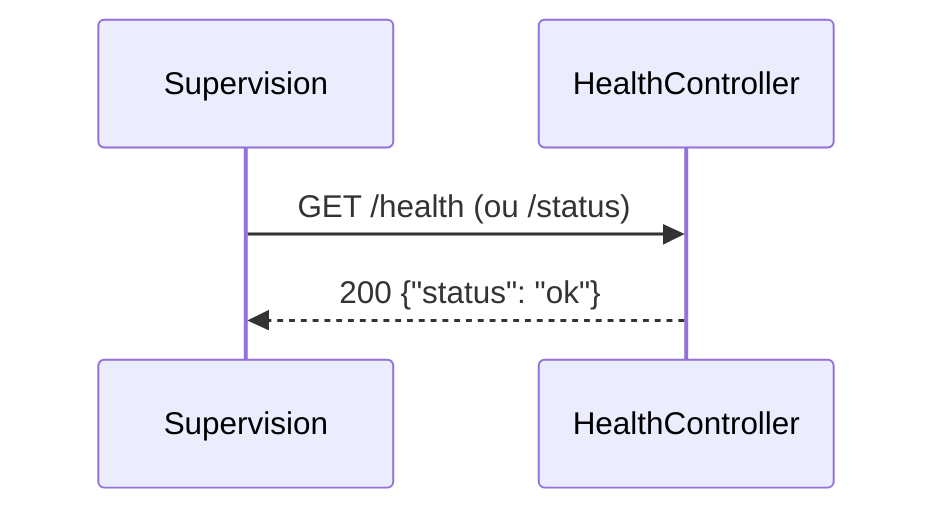

# GET /health
`route.health` · type : routes · dernière mise à jour : 2026-09-16 · commit : d15a772

## Résumé

Point de santé de l'application, joignable sur `/health` et sur `/status` : répond `{"status": "ok"}` en JSON,
sans authentification, pour la supervision.

## Déclencheur

| Élément | Valeur |
|---|---|
| Point d'entrée | `GET /health` (`app_health`) |
| Satellite | `GET /status` (`app_status`) |
| Sécurité | — |
| Préconditions | — |

## Parcours

## Navigation / états

—

## Décisions

—

## Données

Aucune donnée lue ni écrite.

## Mécanismes transverses

`LocaleListener` sur `kernel.request`, sans effet sur une réponse JSON ; aucune règle d'accès.

## Points d'attention

Répond « ok » sans rien vérifier (ni dépendance, ni stockage) : il dit que PHP répond, pas que l'application
fonctionne.

## Workflows liés

—

## Historique

| Date | Commit | Changement |
|---|---|---|
| 2026-09-16 | d15a772 | rédaction initiale |
