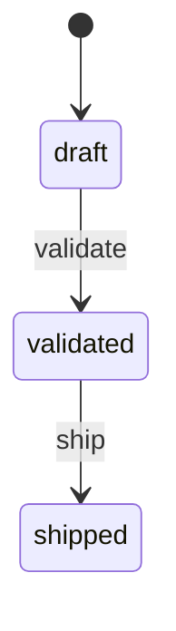

# /orders
`order` · type: routes · 4 routes · `src/Controller/OrderController.php`

## Summary

Les commandes du catalogue : leur liste, leur création, leur fiche et leur validation. Une commande naît en brouillon, reçoit son prix, puis passe validée — et c'est ce passage qui déclenche les messages que le reste du produit écoute. Le tarif est calculé par un service partagé, jamais dans l'écran.

## Routes

| Route | Path | Methods | Security |
|---|---|---|---|
| [`app_order_index`](index.md) | `/orders` | `GET` | `ROLE_USER` |
| [`app_order_new`](new.md) | `/orders/new` | `GET\|POST` | `ROLE_USER`, `ROLE_OPERATOR` |
| [`app_order_show`](show.md) | `/orders/{id}` | `GET` | `ROLE_USER` |
| [`app_order_validate`](validate.md) | `/orders/{id}/validate` | `POST` | `ROLE_USER`, `ROLE_MANAGER` |

## States

