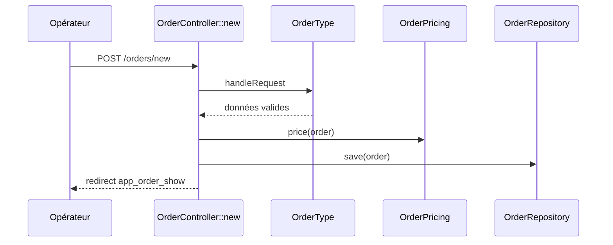
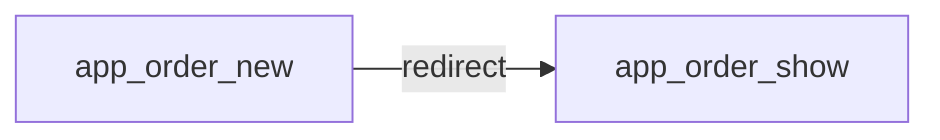
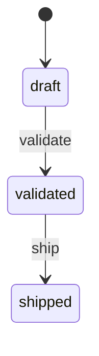
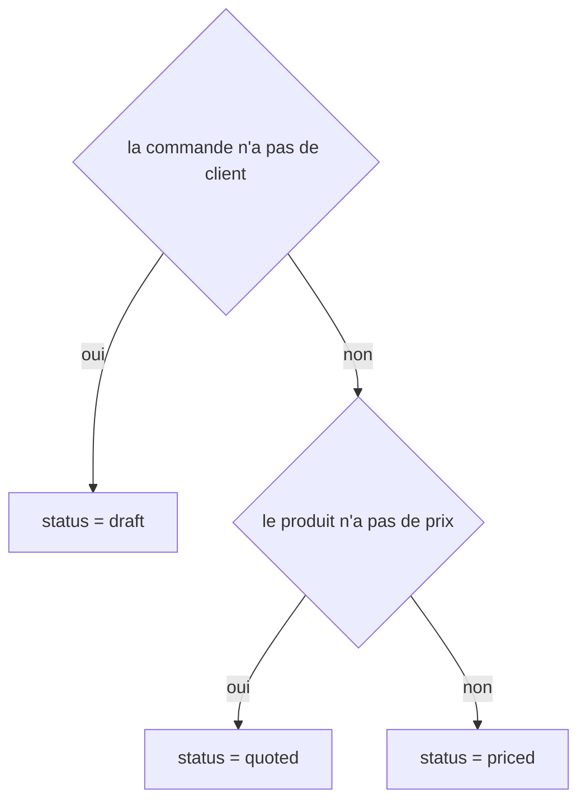
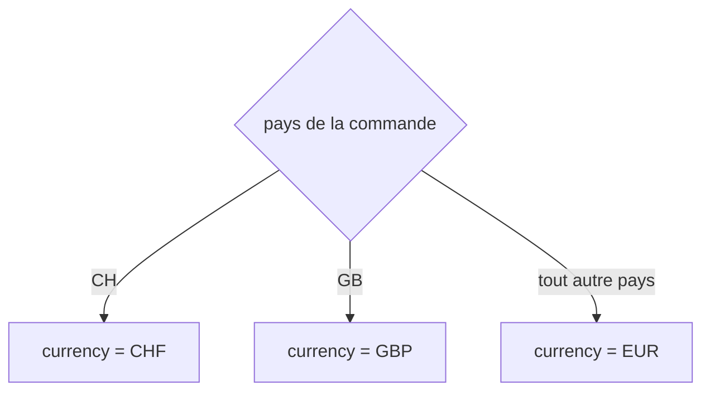

# GET|POST /orders/new
`route.order.new` · type : routes · dernière mise à jour : 2026-09-16 · commit : d15a772

## Résumé

Crée une commande à partir du formulaire `OrderType` : un opérateur saisit le client et le produit, la
commande est tarifée par `OrderPricing` puis enregistrée, et l'opérateur est redirigé vers sa fiche.

## Déclencheur

| Élément | Valeur |
|---|---|
| Point d'entrée | `GET\|POST /orders/new` (`app_order_new`) |
| Sécurité | `ROLE_USER`, `ROLE_OPERATOR` |
| Préconditions | Le catalogue de produits est chargé. |

## Parcours

## Navigation / états

## Décisions

**`App\Entity\Order::status`**

**`App\Entity\Order::currency`**

## Données

Écrit une `Order` en mémoire via `src/Repository/OrderRepository.php` ; lit le prix des produits.

## Mécanismes transverses

`LocaleListener` fixe la locale à chaque requête avant le contrôleur.

## Points d'attention

Le prix vaut toujours 0 : `Product` crée son prix à zéro et rien ne le renseigne.

## Workflows liés

- [`route.order.show`](show.md) — navigation

## Historique

| Date | Commit | Changement |
|---|---|---|
| 2026-09-16 | d15a772 | rédaction initiale |
