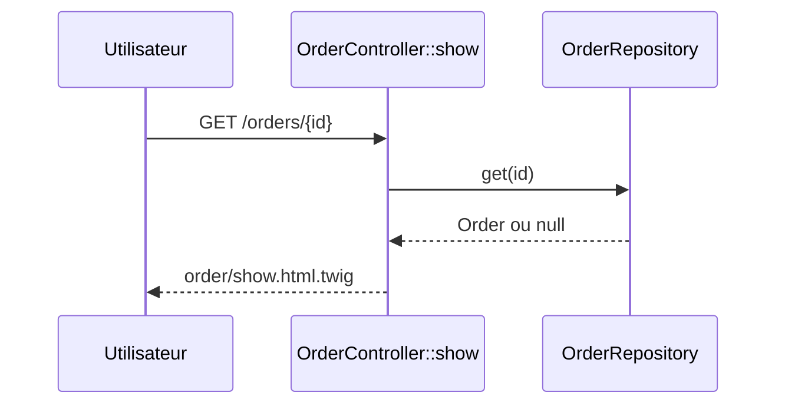

# GET /orders/{id}
`route.order.show` · type : routes · dernière mise à jour : 2026-09-16 · commit : f815420

## Résumé

Affiche la fiche d'une commande identifiée par son `id` : le client de la commande.

## Déclencheur

| Élément | Valeur |
|---|---|
| Point d'entrée | `GET /orders/{id}` (`app_order_show`) |
| Sécurité | `ROLE_USER` |
| Préconditions | Utilisateur authentifié (ROLE_USER). |

## Parcours

## Navigation / états

—

## Décisions

—

## Données

Lit une `Order` dans `src/Repository/OrderRepository.php`.

## Mécanismes transverses

`LocaleListener` sur `kernel.request` ; access_control ROLE_USER sur `^/orders`.

## Points d'attention

Un identifiant inconnu n'est pas traité : `get()` renvoie null et le template lit `order.customer` sur une
valeur nulle, au lieu d'une réponse 404.

## Workflows liés

—

## Historique

| Date | Commit | Changement |
|---|---|---|
| 2026-09-16 | f815420 | rédaction initiale |
