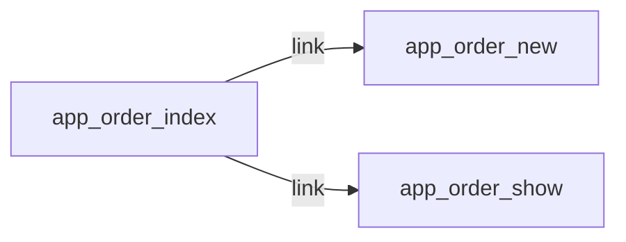

# GET /orders
`route.order.index` · type: routes · last updated: 2026-09-16 · commit: 65429e2

## Summary

—

## Trigger

| Element | Value |
|---|---|
| Entry point | `GET /orders` (`app_order_index`) |
| Security | `ROLE_USER` |
| Preconditions | — |

## Journey

—

## Navigation / states

## Decisions

—

## Data

—

## Cross-cutting mechanisms

| Mechanism | Event | Priority | Writes |
|---|---|---|---|
| `App\EventListener\LocaleListener` | `kernel.request` | 20 | — |

## Points of attention

—

## Related workflows

- [`route.order.new`](order.new.md) — navigation
- [`route.order.show`](order.show.md) — navigation

## History

| Date | Commit | Change |
|---|---|---|
| 2026-09-16 | 65429e2 | initial |
