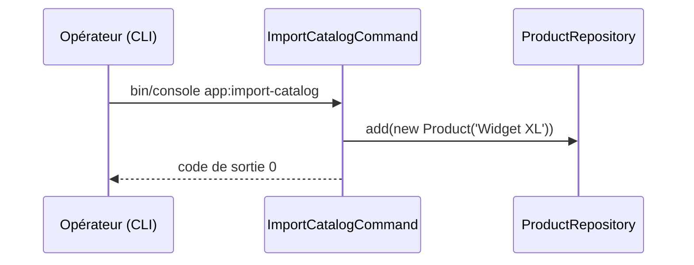

# app:import-catalog
`command.app.import-catalog` · type : commands · dernière mise à jour : 2026-09-16 · commit : 65429e2

## Résumé

Commande console d'import du catalogue : ajoute le produit « Widget XL » au dépôt des produits.

## Déclencheur

| Élément | Valeur |
|---|---|
| Point d'entrée | `app:import-catalog` (command) |
| Sécurité | — |
| Préconditions | — |

## Parcours

## Navigation / états

—

## Décisions

—

## Données

Écrit un `Product` dans `src/Repository/ProductRepository.php`, en mémoire.

## Mécanismes transverses

—

## Points d'attention

Le dépôt est en mémoire et vit le temps de la commande : l'import n'a aucun effet durable. Le produit est
écrit en dur ; aucun fichier de catalogue n'est lu.

## Workflows liés

—

## Historique

| Date | Commit | Changement |
|---|---|---|
| 2026-09-16 | 65429e2 | rédaction initiale |
