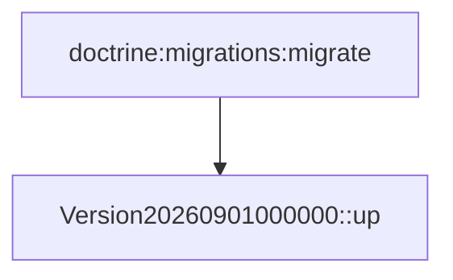

# Migrations
`data.migrations` · type: data · last updated: 2026-09-16 · commit: 65429e2

## Summary

Migrations de la base : une seule version, `Version20260901000000`, dont la méthode `up()` est vide.

## Trigger

| Element | Value |
|---|---|
| Entry point | `migrations` (migration) |
| Security | — |
| Preconditions | — |

## Journey

## Navigation / states

—

## Decisions

—

## Data

Aucune modification de schéma.

## Cross-cutting mechanisms

—

## Points of attention

Le projet n'installe pas Doctrine Migrations : ce fichier n'est exécuté par rien. Il est documenté parce qu'il
se trouve dans `migrations/`.

## Related workflows

—

## History

| Date | Commit | Change |
|---|---|---|
| 2026-09-16 | 65429e2 | rédaction initiale |
