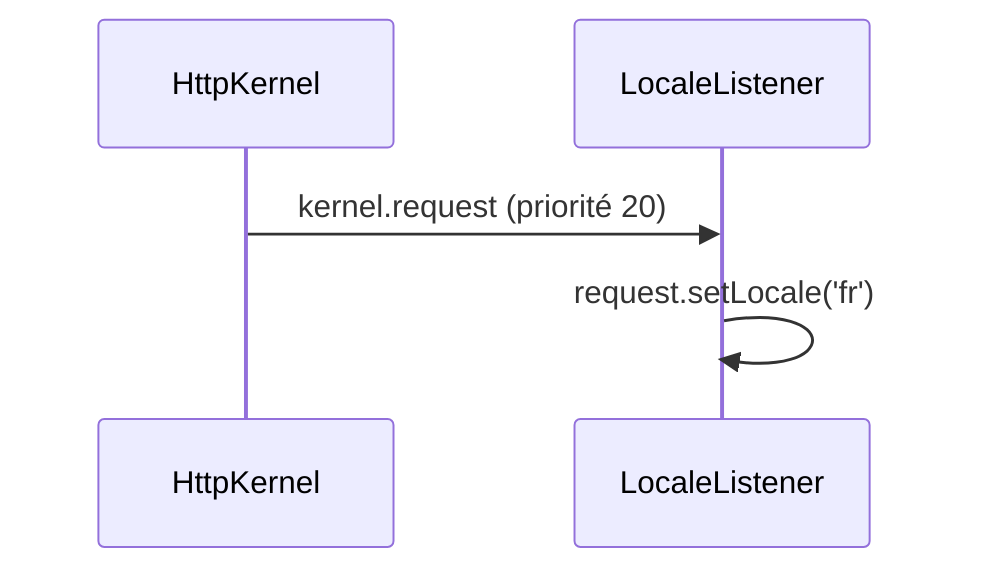

# kernel.request → LocaleListener
`event.locale-listener` · type : events · dernière mise à jour : 2026-09-16 · commit : d3202e4

## Résumé

Listener global de `kernel.request` : fixe la locale de chaque requête à `fr`, avant la résolution du
contrôleur.

## Déclencheur

| Élément | Valeur |
|---|---|
| Point d'entrée | `App\EventListener\LocaleListener` (listener) |
| Events | `kernel.request` |
| Sécurité | — |
| Préconditions | — |

## Parcours

## Navigation / états

—

## Composants impliqués

| Rôle | Fichier | Notes |
|---|---|---|
| Listener | `src/EventListener/LocaleListener.php` | point d'entrée |

Paquets : `symfony/http-kernel` 7.4.19

## Données

Modifie la locale de la `Request` courante. Aucune donnée persistante.

## Mécanismes transverses

Enregistré par `#[AsEventListener]` avec la priorité 20, donc après le `LocaleListener` de Symfony (priorité
100) : la locale posée ici l'emporte sur celle de la route.

## Points d'attention

La locale est codée en dur : tout `_locale` de route ou préférence utilisateur est ignoré. Toutes les routes
dépendent de ce listener.

## Tests existants

—

## Workflows liés

—

## Historique

| Date | Commit | Changement |
|---|---|---|
| 2026-09-16 | d3202e4 | rédaction initiale |
