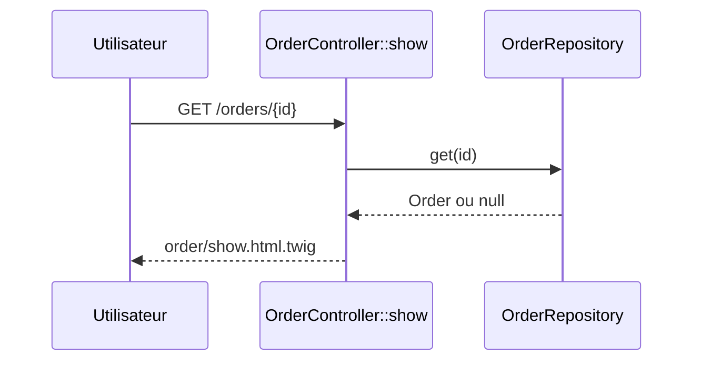

# GET /orders/{id}
`route.order.show` · type: routes · last updated: 2026-09-16 · commit: 65429e2

## Summary

Affiche la fiche d'une commande identifiée par son `id` : le client de la commande.

## Trigger

| Element | Value |
|---|---|
| Entry point | `GET /orders/{id}` (`app_order_show`) |
| Security | `ROLE_USER` |
| Preconditions | Utilisateur authentifié (ROLE_USER). |

## Journey

## Navigation / states

—

## Decisions

—

## Data

Lit une `Order` dans `src/Repository/OrderRepository.php`.

## Cross-cutting mechanisms

`LocaleListener` sur `kernel.request` ; access_control ROLE_USER sur `^/orders`.

## Points of attention

Un identifiant inconnu n'est pas traité : `get()` renvoie null et le template lit `order.customer` sur une
valeur nulle, au lieu d'une réponse 404.

## Related workflows

—

## History

| Date | Commit | Changement |
|---|---|---|
| 2026-09-16 | 65429e2 | rédaction initiale |
