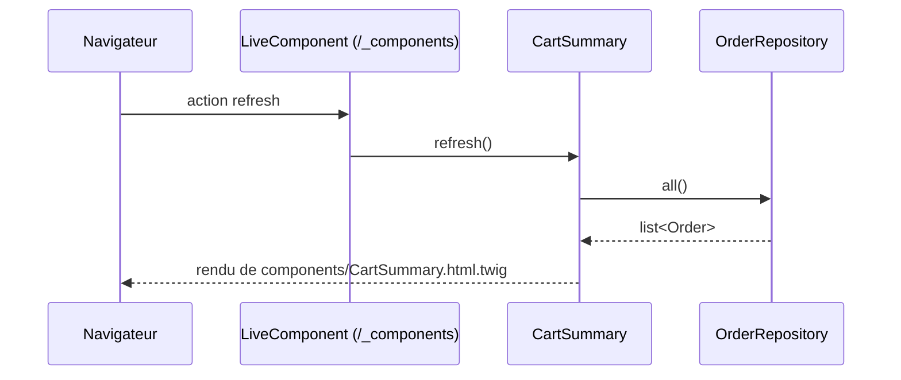

# CartSummary
`ui.cart-summary` · type: ui · last updated: 2026-09-16 · commit: 65429e2

## Summary

Composant live `CartSummary` : affiche le nombre de commandes et le recalcule à la demande, par l'action live
`refresh`, sans recharger la page.

## Trigger

| Element | Value |
|---|---|
| Entry point | `App\Twig\Components\CartSummary` (component) |
| Live | `true` |
| Security | — |
| Preconditions | — |

## Journey

## Navigation / states

—

## Decisions

—

## Data

Lit les commandes dans `src/Repository/OrderRepository.php` ; la propriété `count` est une LiveProp modifiable
côté client.

## Cross-cutting mechanisms

Route `/_components/{_live_component}/{_live_action}` fournie par LiveComponentBundle.

## Points of attention

`count` est `writable` : le client peut le modifier sans passer par `refresh`. Au premier rendu il vaut 0 tant
que `refresh` n'a pas été appelé.

## Related workflows

—

## History

| Date | Commit | Changement |
|---|---|---|
| 2026-09-16 | 65429e2 | rédaction initiale |
