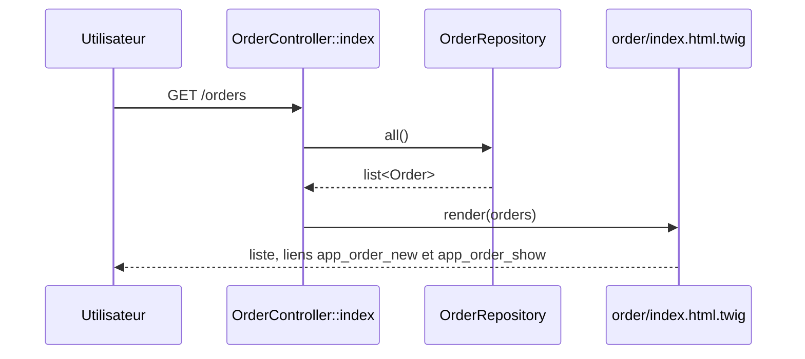
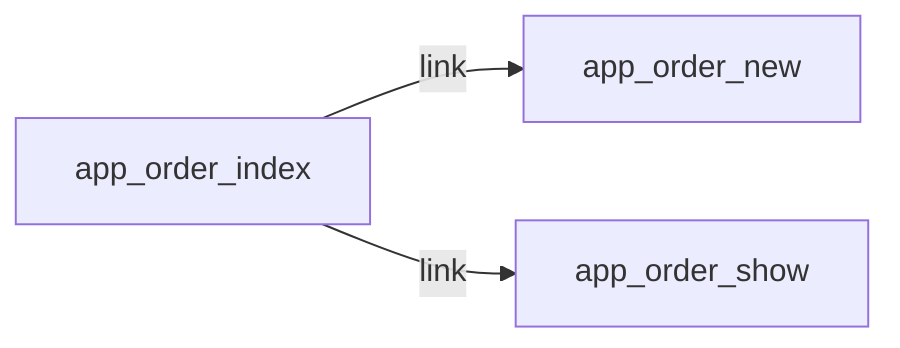

# GET /orders
`route.order.index` · type : routes · dernière mise à jour : 2026-09-16 · commit : 978ffc6

## Résumé

Liste les commandes existantes. La page affiche le résumé du panier (composant live `CartSummary`), un lien de
création et, pour chaque commande, un lien vers sa fiche.

## Déclencheur

| Élément | Valeur |
|---|---|
| Point d'entrée | `GET /orders` (`app_order_index`) |
| Sécurité | `ROLE_USER` |
| Préconditions | Utilisateur authentifié (ROLE_USER, imposé par access_control sur ^/orders). |

## Parcours

## Navigation / états

## Composants impliqués

| Rôle | Fichier | Notes |
|---|---|---|
| Configuration | `config/packages/security.yaml` |  |
| Configuration | `config/routes.yaml` |  |
| Contrôleur | `src/Controller/OrderController.php` | point d'entrée |
| Entité | `src/Entity/Order.php` |  |
| Repository | `src/Repository/OrderRepository.php` |  |
| Autre | `src/ValueObject/Money.php` |  |
| Template | `templates/base.html.twig` |  |
| Template | `templates/order/index.html.twig` |  |

Paquets : `symfony/framework-bundle` 7.4.19, `symfony/http-foundation` 7.4.19

## Données

Lit toutes les `Order` du dépôt en mémoire `src/Repository/OrderRepository.php`. N'écrit rien.

## Mécanismes transverses

`LocaleListener` sur `kernel.request` ; access_control ROLE_USER sur `^/orders`.

## Points d'attention

Pas de pagination : le dépôt renvoie toutes les commandes. Le composant `CartSummary` rendu dans la page a son
propre workflow (`ui.cart-summary`).

## Tests existants

| Test | Fichier | Couvre |
|---|---|---|
| OrderControllerTest | `tests/Controller/OrderControllerTest.php` | — |

## Workflows liés

- [`event.locale-listener`](../events/locale-listener.md) — dépend de
- [`route.order.new`](order.new.md) — navigation
- [`route.order.show`](order.show.md) — navigation

## Historique

| Date | Commit | Changement |
|---|---|---|
| 2026-09-16 | 978ffc6 | rédaction initiale |
