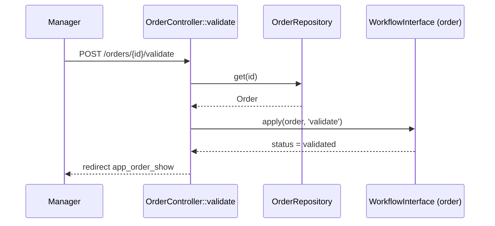
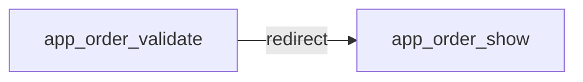
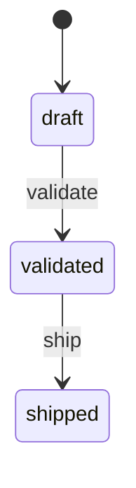

# POST /orders/{id}/validate
`route.order.validate` · type : routes · dernière mise à jour : 2026-09-16 · commit : 978ffc6

## Résumé

Valide une commande : applique la transition `validate` de la machine à états `order`, qui fait passer la
commande de `draft` à `validated`, puis redirige vers sa fiche.

## Déclencheur

| Élément | Valeur |
|---|---|
| Point d'entrée | `POST /orders/{id}/validate` (`app_order_validate`) |
| Sécurité | `ROLE_USER`, `ROLE_MANAGER` |
| Préconditions | Commande à l'état draft ; utilisateur avec ROLE_MANAGER. |

## Parcours

## Navigation / états

## Composants impliqués

| Rôle | Fichier | Notes |
|---|---|---|
| Configuration | `config/packages/framework.yaml` |  |
| Configuration | `config/packages/security.yaml` |  |
| Configuration | `config/routes.yaml` |  |
| Contrôleur | `src/Controller/OrderController.php` | point d'entrée |
| Entité | `src/Entity/Order.php` |  |
| Repository | `src/Repository/OrderRepository.php` |  |
| Autre | `src/ValueObject/Money.php` |  |

Paquets : `symfony/framework-bundle` 7.4.19, `symfony/http-foundation` 7.4.19, `symfony/security-http` 7.4.19, `symfony/workflow` 7.4.9

## Données

Lit l'`Order` et modifie sa propriété `status` (marking store `method`) ; la machine est déclarée dans
`config/packages/framework.yaml`.

## Mécanismes transverses

`LocaleListener` sur `kernel.request` ; access_control ROLE_USER, puis `#[IsGranted]` ROLE_MANAGER.

## Points d'attention

La commande modifiée n'est pas ré-enregistrée (`save` n'est pas appelé). Une transition impossible (commande
déjà validée) lève une exception non interceptée : réponse 500 au lieu d'un message.

## Tests existants

—

## Workflows liés

- [`event.locale-listener`](../events/locale-listener.md) — dépend de
- [`route.order.show`](order.show.md) — navigation

## Historique

| Date | Commit | Changement |
|---|---|---|
| 2026-09-16 | 978ffc6 | rédaction initiale |
