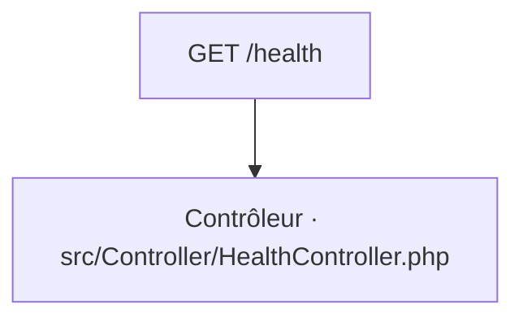

# GET /health
`route.health` · type : routes · dernière mise à jour : 2026-09-16 · commit : 6753625

## Résumé

—

## Déclencheur

| Élément | Valeur |
|---|---|
| Point d'entrée | `GET /health` (`app_health`) |
| Satellite | `GET /status` (`app_status`) |
| Sécurité | — |
| Préconditions | — |

## Parcours

## Navigation / états

—

## Composants impliqués

| Rôle | Fichier | Notes |
|---|---|---|
| Configuration | `config/packages/security.yaml` |  |
| Configuration | `config/routes.yaml` |  |
| Configuration | `config/routes/ux_live_component.yaml` |  |
| Configuration | `config/services.yaml` |  |
| Contrôleur | `src/Controller/HealthController.php` | point d'entrée |

Paquets : `symfony/http-foundation` 8.1.7, `symfony/routing` 8.1.6

## Données

—

## Mécanismes transverses

- [`event.locale-listener`](../events/locale-listener.md)

## Points d'attention

—

## Tests existants

—

## Workflows liés

- [`event.locale-listener`](../events/locale-listener.md) — dépend de

## Historique

| Date | Commit | Changement |
|---|---|---|
| 2026-09-16 | 6753625 | initial |
