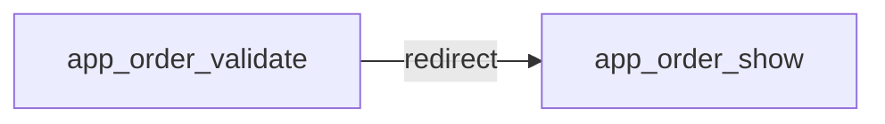
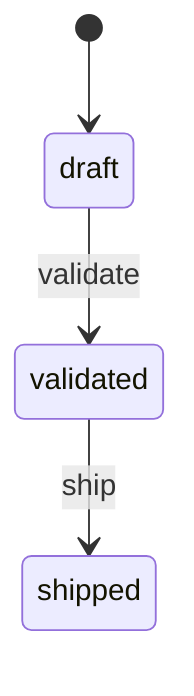

# POST /orders/{id}/validate
`route.order.validate` · type: routes · last updated: 2026-09-16 · commit: f815420

## Summary

—

## Trigger

| Element | Value |
|---|---|
| Entry point | `POST /orders/{id}/validate` (`app_order_validate`) |
| Security | `ROLE_USER`, `ROLE_MANAGER` |
| Preconditions | — |

## Journey

—

## Navigation / states

## Decisions

—

## Data

—

## Cross-cutting mechanisms

| Mechanism | Event | Priority | Writes |
|---|---|---|---|
| `App\EventListener\LocaleListener` | `kernel.request` | 20 | — |
| `App\EventListener\TotalsListener` | `prePersist` | — | — |

## Points of attention

—

## Related workflows

- [`route.order.show`](order.show.md) — navigation

## History

| Date | Commit | Change |
|---|---|---|
| 2026-09-16 | f815420 | initial |
