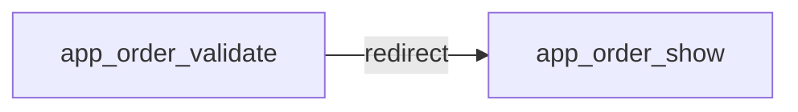
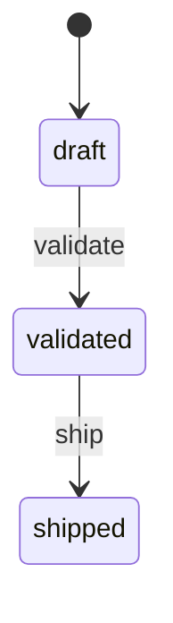

# POST /orders/{id}/validate
`route.order.validate` · type : routes · dernière mise à jour : 2026-09-16 · commit : f815420

## Résumé

—

## Déclencheur

| Élément | Valeur |
|---|---|
| Point d'entrée | `POST /orders/{id}/validate` (`app_order_validate`) |
| Sécurité | `ROLE_USER`, `ROLE_MANAGER` |
| Préconditions | — |

## Parcours

—

## Navigation / états

## Décisions

—

## Données

—

## Mécanismes transverses

| Mécanisme | Événement | Priorité | Écrit |
|---|---|---|---|
| `App\EventListener\LocaleListener` | `kernel.request` | 20 | — |
| `App\EventListener\TotalsListener` | `prePersist` | — | — |

## Points d'attention

—

## Workflows liés

- [`route.order.show`](order.show.md) — navigation

## Historique

| Date | Commit | Changement |
|---|---|---|
| 2026-09-16 | f815420 | initial |
