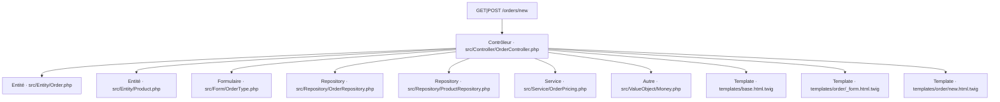
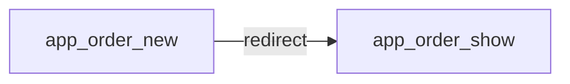

# GET|POST /orders/new
`route.order.new` · type : routes · dernière mise à jour : 2026-09-16 · commit : f16c698

## Résumé

—

## Déclencheur

| Élément | Valeur |
|---|---|
| Point d'entrée | `GET\|POST /orders/new` (`app_order_new`) |
| Sécurité | `ROLE_USER`, `ROLE_OPERATOR` |
| Préconditions | — |

## Parcours

## Navigation / états

## Composants impliqués

| Rôle | Fichier | Notes |
|---|---|---|
| Configuration | `config/packages/security.yaml` |  |
| Configuration | `config/routes.yaml` |  |
| Configuration | `config/routes/ux_live_component.yaml` |  |
| Configuration | `config/services.yaml` |  |
| Contrôleur | `src/Controller/OrderController.php` | point d'entrée |
| Entité | `src/Entity/Order.php` |  |
| Entité | `src/Entity/Product.php` |  |
| Formulaire | `src/Form/OrderType.php` |  |
| Repository | `src/Repository/OrderRepository.php` |  |
| Repository | `src/Repository/ProductRepository.php` |  |
| Service | `src/Service/OrderPricing.php` |  |
| Autre | `src/ValueObject/Money.php` |  |
| Template | `templates/base.html.twig` |  |
| Template | `templates/order/_form.html.twig` |  |
| Template | `templates/order/new.html.twig` |  |

Paquets : `symfony/form` 8.1.7, `symfony/framework-bundle` 8.1.7, `symfony/http-foundation` 8.1.7, `symfony/options-resolver` 8.1.0, `symfony/routing` 8.1.6, `symfony/security-http` 8.1.7

## Données

—

## Mécanismes transverses

- [`event.locale-listener`](../events/locale-listener.md)

## Points d'attention

—

## Tests existants

| Test | Fichier | Couvre |
|---|---|---|
| OrderPricingTest | `tests/Service/OrderPricingTest.php` | — |

## Workflows liés

- [`event.locale-listener`](../events/locale-listener.md) — dépend de
- [`route.order.show`](order.show.md) — navigation

## Historique

| Date | Commit | Changement |
|---|---|---|
| 2026-09-16 | f16c698 | initial |
