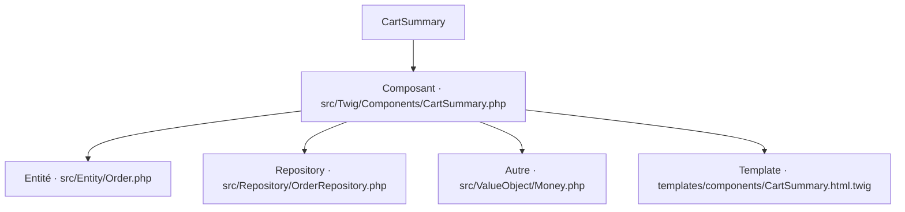

# CartSummary
`ui.cart-summary` · type : ui · dernière mise à jour : 2026-09-16 · commit : f16c698

## Résumé

—

## Déclencheur

| Élément | Valeur |
|---|---|
| Point d'entrée | `App\Twig\Components\CartSummary` (component) |
| Live | `true` |
| Sécurité | — |
| Préconditions | — |

## Parcours

## Navigation / états

—

## Composants impliqués

| Rôle | Fichier | Notes |
|---|---|---|
| Entité | `src/Entity/Order.php` |  |
| Repository | `src/Repository/OrderRepository.php` |  |
| Composant | `src/Twig/Components/CartSummary.php` | point d'entrée |
| Autre | `src/ValueObject/Money.php` |  |
| Template | `templates/components/CartSummary.html.twig` |  |

Paquets : `symfony/ux-live-component` 2.36.0

## Données

—

## Mécanismes transverses

—

## Points d'attention

—

## Tests existants

—

## Workflows liés

—

## Historique

| Date | Commit | Changement |
|---|---|---|
| 2026-09-16 | f16c698 | initial |
