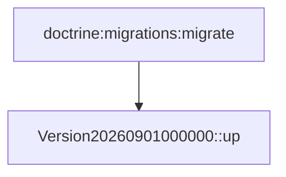

# Migrations
`data.migrations` · type : data · dernière mise à jour : 2026-09-16 · commit : 6753625

## Résumé

Migrations de la base : une seule version, `Version20260901000000`, dont la méthode `up()` est vide.

## Déclencheur

| Élément | Valeur |
|---|---|
| Point d'entrée | `migrations` (migration) |
| Sécurité | — |
| Préconditions | — |

## Parcours

## Navigation / états

—

## Composants impliqués

| Rôle | Fichier | Notes |
|---|---|---|
| Autre | `migrations/Version20260901000000.php` | point d'entrée |

## Données

Aucune modification de schéma.

## Mécanismes transverses

—

## Points d'attention

Le projet n'installe pas Doctrine Migrations : ce fichier n'est exécuté par rien. Il est documenté parce qu'il
se trouve dans `migrations/`.

## Tests existants

—

## Workflows liés

—

## Historique

| Date | Commit | Changement |
|---|---|---|
| 2026-09-16 | 6753625 | rédaction initiale |
