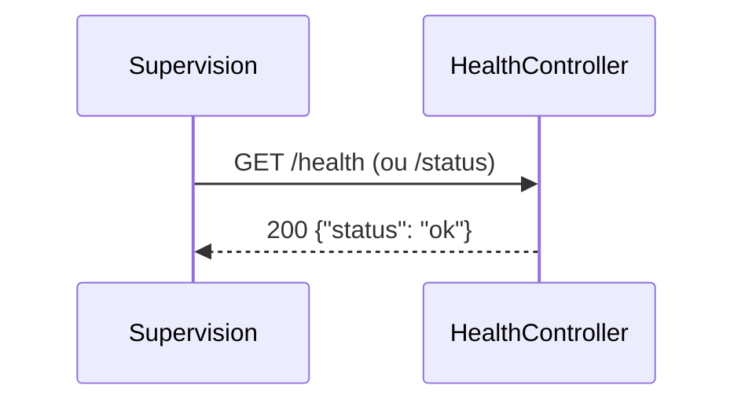

# GET /health
`route.health` · type : routes · dernière mise à jour : 2026-09-16 · commit : 7cf26ca

## Résumé

Point de santé de l'application, joignable sur `/health` et sur `/status` : répond `{"status": "ok"}` en JSON,
sans authentification, pour la supervision.

## Déclencheur

| Élément | Valeur |
|---|---|
| Point d'entrée | `GET /health` (`app_health`) |
| Satellite | `GET /status` (`app_status`) |
| Sécurité | — |
| Préconditions | — |

## Parcours

## Navigation / états

—

## Composants impliqués

| Rôle | Fichier | Notes |
|---|---|---|
| Configuration | `config/packages/security.yaml` |  |
| Configuration | `config/routes.yaml` |  |
| Configuration | `config/routes/ux_live_component.yaml` |  |
| Configuration | `config/services.yaml` |  |
| Contrôleur | `src/Controller/HealthController.php` | point d'entrée |

Paquets : `symfony/http-foundation` 8.1.7, `symfony/routing` 8.1.6

## Données

Aucune donnée lue ni écrite.

## Mécanismes transverses

`LocaleListener` sur `kernel.request`, sans effet sur une réponse JSON ; aucune règle d'accès.

## Points d'attention

Répond « ok » sans rien vérifier (ni dépendance, ni stockage) : il dit que PHP répond, pas que l'application
fonctionne.

## Tests existants

—

## Workflows liés

- [`event.locale-listener`](../events/locale-listener.md) — dépend de

## Historique

| Date | Commit | Changement |
|---|---|---|
| 2026-09-16 | 7cf26ca | rédaction initiale |
