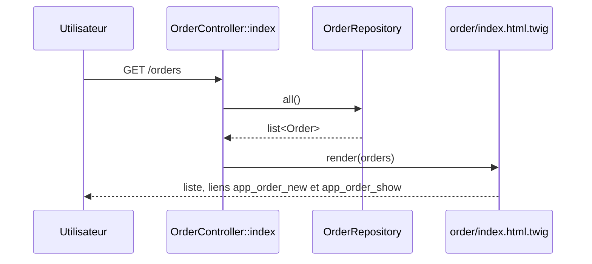
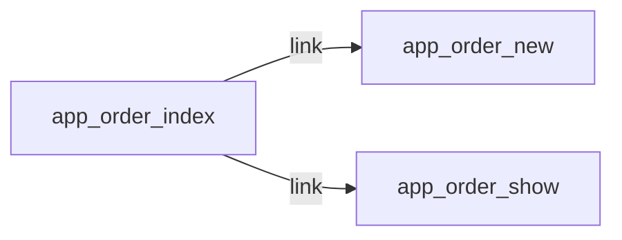

# GET /orders
`route.order.index` · type: routes · last updated: 2026-09-16 · commit: f815420

## Summary

Liste les commandes existantes. La page affiche le résumé du panier (composant live `CartSummary`), un lien de
création et, pour chaque commande, un lien vers sa fiche.

## Trigger

| Element | Value |
|---|---|
| Entry point | `GET /orders` (`app_order_index`) |
| Security | `ROLE_USER` |
| Preconditions | Utilisateur authentifié (ROLE_USER, imposé par access_control sur ^/orders). |

## Journey

## Navigation / states

## Decisions

—

## Data

Lit toutes les `Order` du dépôt en mémoire `src/Repository/OrderRepository.php`. N'écrit rien.

## Cross-cutting mechanisms

`LocaleListener` sur `kernel.request` ; access_control ROLE_USER sur `^/orders`.

## Points of attention

Pas de pagination : le dépôt renvoie toutes les commandes. Le composant `CartSummary` rendu dans la page a son
propre workflow (`ui.cart-summary`).

## Related workflows

- [`route.order.new`](order.new.md) — navigation
- [`route.order.show`](order.show.md) — navigation

## History

| Date | Commit | Changement |
|---|---|---|
| 2026-09-16 | f815420 | rédaction initiale |
