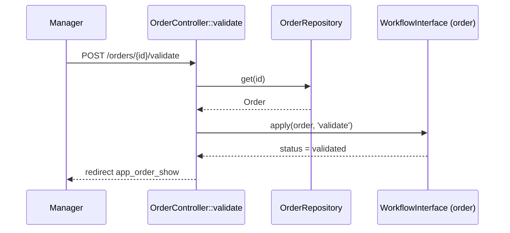
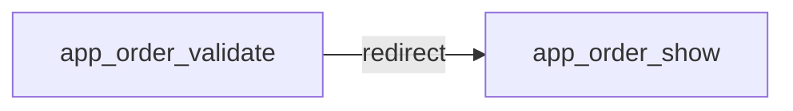
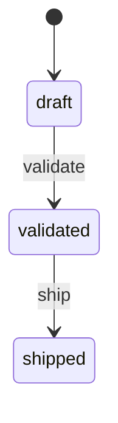

# POST /orders/{id}/validate
`route.order.validate` · type: routes · last updated: 2026-09-16 · commit: f815420

## Summary

Valide une commande : applique la transition `validate` de la machine à états `order`, qui fait passer la
commande de `draft` à `validated`, puis redirige vers sa fiche.

## Trigger

| Element | Value |
|---|---|
| Entry point | `POST /orders/{id}/validate` (`app_order_validate`) |
| Security | `ROLE_USER`, `ROLE_MANAGER` |
| Preconditions | Commande à l'état draft ; utilisateur avec ROLE_MANAGER. |

## Journey

## Navigation / states

## Decisions

—

## Data

Lit l'`Order` et modifie sa propriété `status` (marking store `method`) ; la machine est déclarée dans
`config/packages/framework.yaml`.

## Cross-cutting mechanisms

`LocaleListener` sur `kernel.request` ; access_control ROLE_USER, puis `#[IsGranted]` ROLE_MANAGER.

## Points of attention

La commande modifiée n'est pas ré-enregistrée (`save` n'est pas appelé). Une transition impossible (commande
déjà validée) lève une exception non interceptée : réponse 500 au lieu d'un message.

## Related workflows

- [`route.order.show`](order.show.md) — navigation

## History

| Date | Commit | Changement |
|---|---|---|
| 2026-09-16 | f815420 | rédaction initiale |
