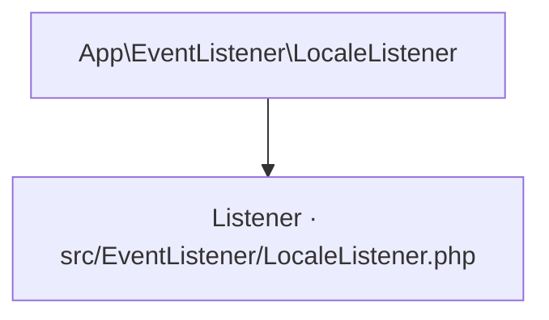

# App\EventListener\LocaleListener
`event.locale-listener` · type: events · last updated: 2026-09-16 · commit: a1b2c3d

## Summary

—

## Trigger

| Element | Value |
|---|---|
| Entry point | `App\EventListener\LocaleListener` (listener) |
| Events | `kernel.request` |
| Security | — |
| Preconditions | — |

## Journey

## Navigation / states

—

## Composants impliqués

| Rôle | Fichier | Notes |
|---|---|---|
| Listener | `src/EventListener/LocaleListener.php` | point d'entrée |

## Data

—

## Cross-cutting mechanisms

—

## Points of attention

—

## Tests existants

—

## Related workflows

—

## History

| Date | Commit | Changement |
|---|---|---|
| 2026-08-02 | 9f8e7d6 | initial |
| 2026-09-16 | a1b2c3d | ajout du service de pricing |
