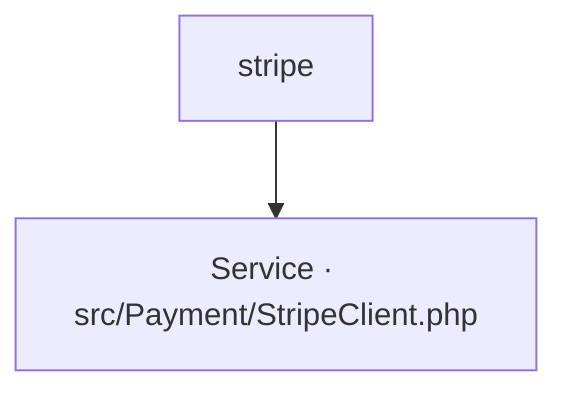

# stripe
`integration.stripe` · type : integrations · dernière mise à jour : 2026-09-16 · commit : a1b2c3d

## Résumé

—

## Déclencheur

| Élément | Valeur |
|---|---|
| Point d'entrée | `stripe` (integration) |
| Sécurité | — |
| Préconditions | — |

## Parcours

## Navigation / états

—

## Composants impliqués

| Rôle | Fichier | Notes |
|---|---|---|
| Service | `src/Payment/StripeClient.php` | point d'entrée |

## Données

—

## Mécanismes transverses

—

## Points d'attention

—

## Tests existants

—

## Workflows liés

—

## Historique

| Date | Commit | Changement |
|---|---|---|
| 2026-08-02 | 9f8e7d6 | initial |
| 2026-09-16 | a1b2c3d | ajout du service de pricing |
