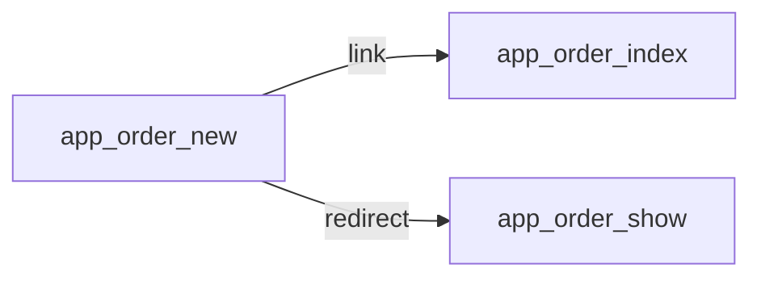
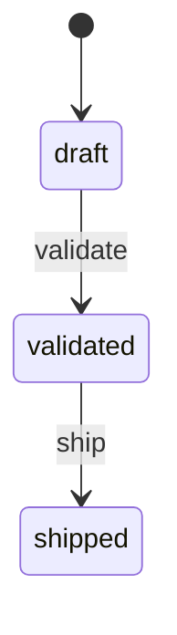

# Order creation
`route.order.new` · type: routes · last updated: 2026-09-16 · commit: a1b2c3d

## Summary

—

## Trigger

| Element | Value |
|---|---|
| Entry point | `GET\|POST /orders/new` (`app_order_new`) |
| Satellite | `GET\|POST /orders/new` (`app_order_new_localized`) |
| Security | `ROLE_OPERATOR` |
| Preconditions | — |

## Journey

—

## Navigation / states

## Decisions

—

## Data

—

## Cross-cutting mechanisms

| Mechanism | Event | Priority | Writes |
|---|---|---|---|
| `App\EventListener\LocaleListener` | `kernel.request` | 16 | — |

## Points of attention

—

## Related workflows

- `route.order.index` — depends on
- [`route.order.show`](order.show.md) — depends on

## History

| Date | Commit | Changement |
|---|---|---|
| 2026-08-02 | 9f8e7d6 | initial |
| 2026-09-16 | a1b2c3d | ajout du service de pricing |
