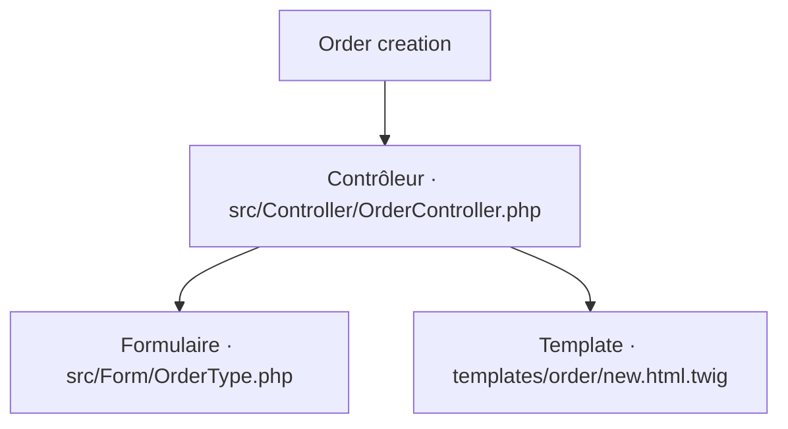
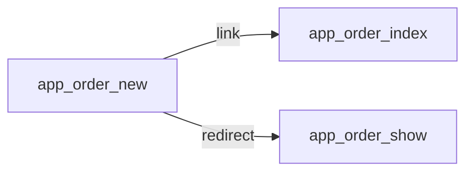
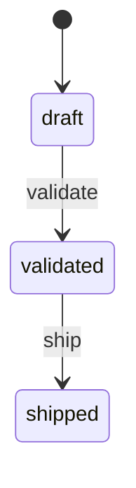

# Order creation
`route.order.new` · type : routes · dernière mise à jour : 2026-09-16 · commit : a1b2c3d

## Résumé

—

## Déclencheur

| Élément | Valeur |
|---|---|
| Point d'entrée | `GET\|POST /orders/new` (`app_order_new`) |
| Satellite | `GET\|POST /orders/new` (`app_order_new_localized`) |
| Sécurité | `ROLE_OPERATOR` |
| Préconditions | — |

## Parcours

## Navigation / états

## Composants impliqués

| Rôle | Fichier | Notes |
|---|---|---|
| Contrôleur | `src/Controller/OrderController.php` | point d'entrée |
| Formulaire | `src/Form/OrderType.php` |  |
| Template | `templates/order/new.html.twig` |  |

Paquets : `doctrine/orm` 3.5.2, `symfony/form` 7.4.3

## Données

—

## Mécanismes transverses

- [`event.locale-listener`](../events/locale-listener.md)

## Points d'attention

—

## Tests existants

| Test | Fichier | Couvre |
|---|---|---|
| OrderControllerTest | `tests/Controller/OrderControllerTest.php` | — |

## Workflows liés

- [`event.locale-listener`](../events/locale-listener.md) — dépend de
- `route.order.index` — dépend de
- [`route.order.show`](order.show.md) — navigation

## Historique

| Date | Commit | Changement |
|---|---|---|
| 2026-08-02 | 9f8e7d6 | initial |
| 2026-09-16 | a1b2c3d | ajout du service de pricing |
